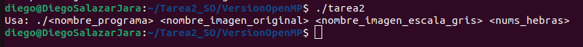
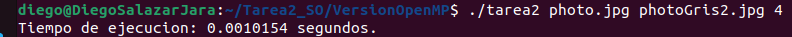
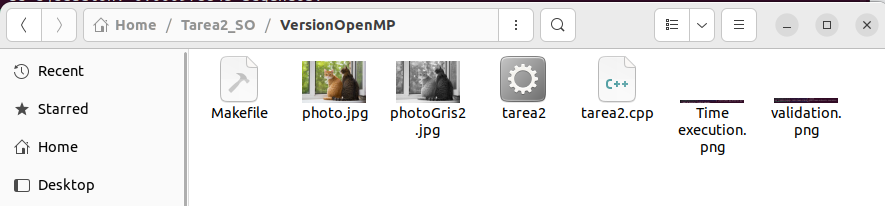

# Ejercicio versión OpenMP

- Este ejercicio es edicado a una version OpenMp, para poder convertir una imagen a color en una imagen completa a escala de grises.

- Utilizamos las bibliotecas necesarias para trabajar con OpenCV, manejar la entrada y salida estándar, y utilizar OpenMP para la programación paralela.

- El uso del using namespace cv y std nos permiten el uso directo de las clses y funciones del OpenCV y el espacio de nombres estandar. 

- La función convertToGrayscale toma una imagen en formato Mat y la convierte a escala de grises, crea una nueva imagen grayscaleImage del mismo tamaño que la imagen original.

- Luego, utiliza una directiva de OpenMP #pragma omp parallel for para paralelizar el bucle externo, lo que permite que múltiples hilos trabajen en diferentes filas de la imagen al mismo tiempo, dentro del bluqle, se obtiene el valor del pixel en Vec3b, se calcula el valor de gris usando la formula y se asigna el valor resultante a la imagen en escala de grises, y devuelve la imagen convertida a escala de grises. 

- Nuestra funcion main comienza verificando si se entregan los argumentos requeridos, y si no se entregan muestra 1 que es un error. 

- Luego obtiene los nombres del archivo de la imagen original y la imagen en escala de grises de los argumentos de la linea de comandos, y se obtiene los numeros de hilos que se utilizaran. Después se carga la imagen utlizando imread de OpenCv y se verifica si se cargó correctamente.

- Luego se establece el numero de hilos usando "omp_set_num_threads", se mide el tiempo de ejecucion usando "omp_get_wtime", antes y despues de llamar a la funcion "convertToGrayscale" para obtener la imagen en escala de grises.

- Después de obtener la imagen en escala de grises, se guarda utilizando un imwrite. Y por ultimo se calcula y muestra el tiempo de ejecucion y se devuelve un 0 para indicar que el programa finalizo correctamente.

- Validación:

- Tiempo de ejecución:

- Carpeta con el contenido despues de ser ejecutado:

