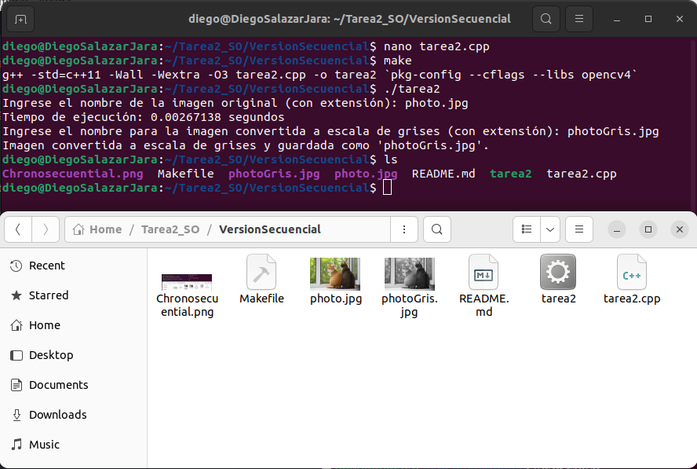

# Ejercicio secuencial

- Este ejercicio es dedicado a una version secuencial, para poder convertir una imagen a color en una imagen completa a escala de grises.
 
- Utilizamos las bibliotecas necesarias de OpenCV para trabajar con imágenes y realizar operaciones de procesamiento de imágenes.

- Nuestra funcion "convertToGraySequential" toma una imagen en formato cv:: mat y la convierte en escala de grises, iterando sobre cada pixel de la imagen y calcula el valor de gris.
 
- Esto lo hace usando la formula: gray = 0.299 * R + 0.587 * G + 0.114 * B. Luego de eso se actualiza el valor de cada componente de color del pixel con el valor del gris calculado.

- Nuestra funcion main comienza leyendo una imagen "photo.jpg" usando una funcion cv::imread, y si la inmagen no se puede leer, se muestra un mensaje de error y termina el programa, si se lee correctamente llama a la funcion "convertToGraySequential" para convertir la imagen a escala de grises.

- Despues de la conversion de la imagen, esta misma se guarda en el archivo "outpot_sequential.jpg" utilizando la funcion cv:imwrite

- Comandos y tiempo de ejecución:

- Como se puede ver utilizando iostream se puede hacer la validación para que te coloque el nombre de la imagen. 

