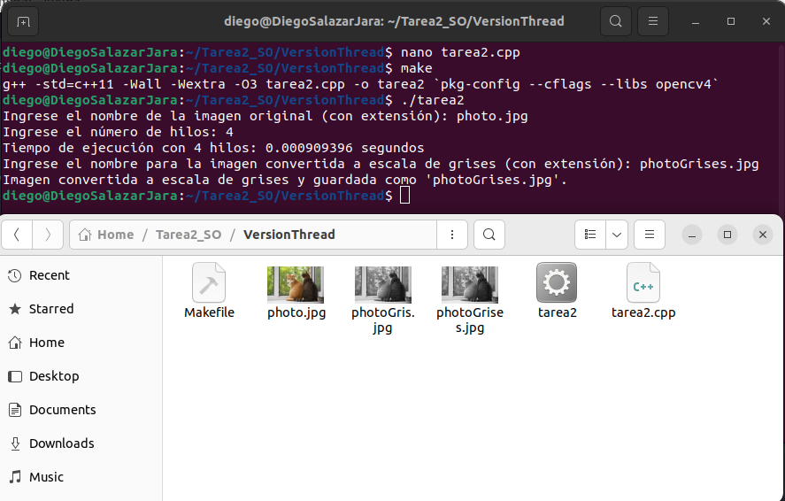

# Ejercicio hebras

- Este ejercicio es dedicado a una version de hebras, para poder convertir una imagen a color en una imagen completa a escala de grises.
 
- Utilizamos las bibliotecas necesarias para trabajar con OpenCV, medir el tiempo de ejecución, manejar la entrada y salida estándar, trabajar con hilos y utilizar vectores.

- Nuestra función convertToGrayThreaded toma una imagen en formato cv::Mat y el número de hilos a utilizar. Usa los tamaños de la imagen y luego inicia un temporizador utilizando la biblioteca chrono. Luego crea un vector de hilos threads con capacidad para num_threads.
 
- Luego se define una función lambda llamada "processChunk", que procesa una parte de la imagen, iterando sobre los pixeles en el rango de filas startRow a endRow y luego realiza la conversion de escala de grises.

- Luego se calcula el tamaño de cada trozo de imagen que sera procesada por cada hilo (chunkSize), ademas se crean num_threads - 1 hilos y se les asigna una parte de la imagen para procesar utilizando la función emplace_back del vector de hilos.

- Finalmente se procesa la ultima parte de la imagen en el hilo principal y se espera a que todos los hilos terminen su ejecución utilizando una funcion join().

- Luego se detiene el temporizador y se calcula la duración de la ejecución utilizando la biblioteca chrono, ademas, se imprime el tiempo transcurrido en segundos.

- Nuestra funcion main comienza solicitando al usuario el nombre de la imagen original y lee la imagen utilizando lafunción cv::imread de OpenCV y verifica si la imagen se leyó correctamente. Luego se solicita al usuario el número de hilos que desea utilizar para convertir la imagen en escala de grises, se llama a la funcion "convertToGrayThreaded" pasandole la imagen original y el numero de hilos.

- Por ultimo se solicita al usuario el nombre para la imagen covertida y se guarda la imagen usando una funcion cv::imwrite de OpenCV, luego se muestra un mensaje indicando el nombre del archivo en el que se guardó la imagen

- Comandos y tiempo de ejecución:

